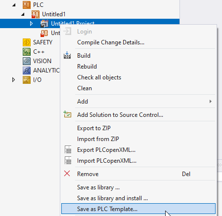
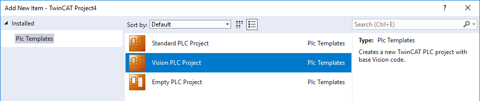
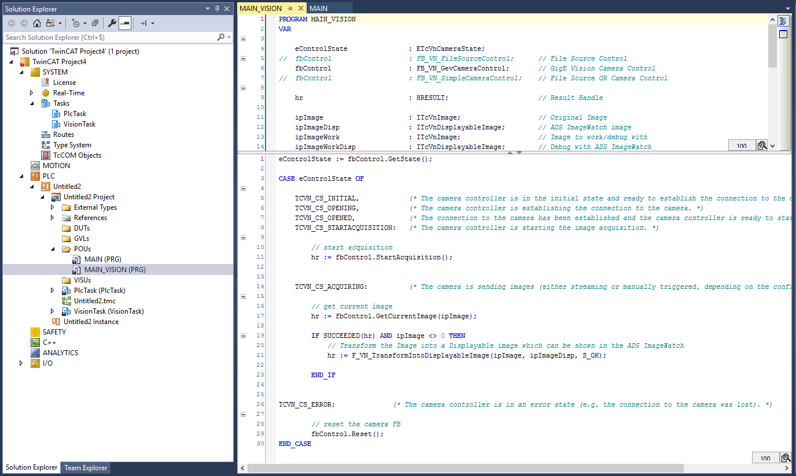

# TF7xxx-PLC.sample.template.plc 
## Abstract 
A quickstart PLC template for Beckhoff TwinCAT - TF7xxx - TcVision 
## Technologies/Versions 
Technologies used within the project:

* [TwinCAT](https://www.beckhoff.com): Version >=3.1.4024 
* [TF7xxx](https://www.beckhoff.com/nl-be/products/automation/twincat/tfxxxx-twincat-3-functions/tf7xxx-vision/)

## License 
- [License](./Legal/License.md)
- [Additional License Information](./Legal/AdditionalLicenseInformation.md)

## TwinCAT 4024 specific Installation
Replace or merge the content in below with the content of this repository
* C:\TwinCAT\3.1\Components\Plc\PlcTemplates\1.0.0.0\Plc Templates
* OR C:\Program Files (x86)\Beckhoff\TwinCAT\3.1\Components\Plc\PlcTemplates\1.0.0.0\Plc Templates

## TwinCAT 4026 specific Installation
Use the instructions for intalled a plc template by right clicking on an existing project plc node that contains the template.

## Usage
1. Install the PLC Template contained in this repository according the instructions above
2. When adding a new PLC project, you can now choose the Vision PLC project template

3. This PLC project contains a PlcVision Task with a 40ms cycle time.
This task calls the MAIN_VISION Program which forms the base of every TC Vision application

